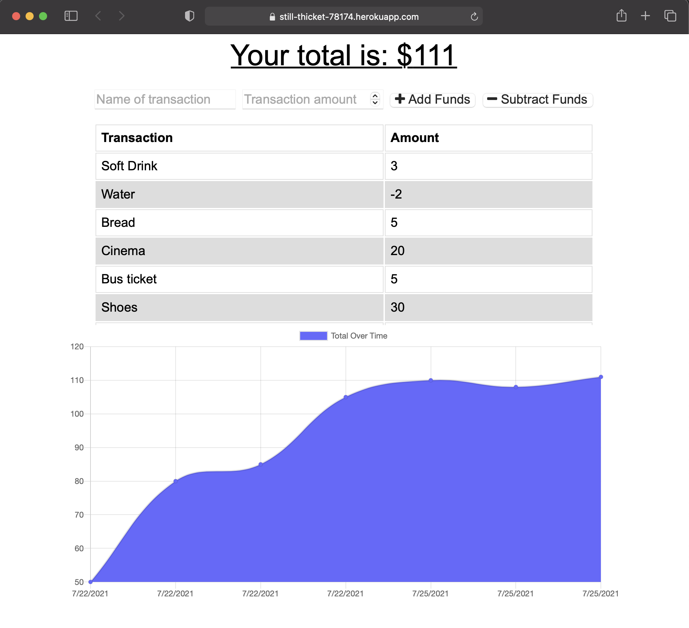
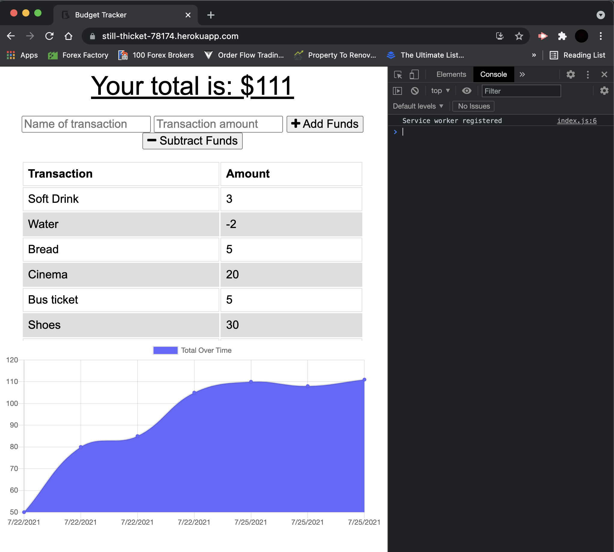

# PWA-budget-tracker

## Description

In this project I have added a manifest.json to allow installation of app on mobile devices, registered a service-worker and installed cache and indexedDB to allow offline usage.

## What I have done

- [x] Added manifest.json to allow installation of app on mobile devices
- [x] Added indexedDB and cache to allow offline use whilst saving data onto browser storage
- [x] Registered service-worker
- [x] Deployed to Heroku using Atlas for database management

## Installation

```
git clone https://github.com/ivnkris/pwa-budget-tracker
cd pwa-budget-tracker
npm install
Set up and connect to MongoDB on your local machine
npm run start
```

## Contributing

Submit a pull request

## Scripts

```
npm run start
```

## Link to GitHub repository

https://github.com/ivnkris/pwa-budget-tracker

## Link to deployed application

https://still-thicket-78174.herokuapp.com

## Screenshots




## Questions

- Send any questions via my [GitHub profile](https://github.com/ivnkris)
